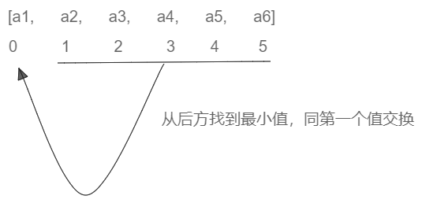

# 选择排序



```go
package main

import "fmt"

func main() {
	arr := []int{5, 3, 4, 2, 1, -1, -2}
	SelectSort(arr)
	fmt.Println(arr)

}

func SelectSort(arr []int) {
	n := len(arr)
	if arr == nil || n < 2 {
		return
	}
	for i := 0; i < n-1; i++ {
		minIndex := i
		for j := i + 1; j < n; j++ {
			if arr[j] < arr[minIndex] {
				minIndex = j
			}
		}
		swap(arr, i, minIndex)
	}
}

func swap(arr []int, i, minIndex int) {
	arr[i], arr[minIndex] = arr[minIndex], arr[i]
}

```
