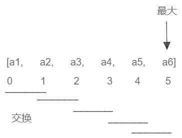

# 冒泡排序


```go
package main

import "fmt"

func main() {
	arr := []int{5, 3, 4, 2, 1}
	Sort(arr)
	fmt.Println(arr)

}

func Sort(arr []int) {
	n := len(arr)
	if arr == nil || n < 2 {
		return
	}
	for end := n - 1; end > 0; end-- {
		for i := 0; i < end; i++ {
			if arr[i] > arr[i+1] {
				swap(arr, i, i+1)
			}
		}
	}

}

func swap(arr []int, i, minIndex int) {
	arr[i], arr[minIndex] = arr[minIndex], arr[i]
}

```