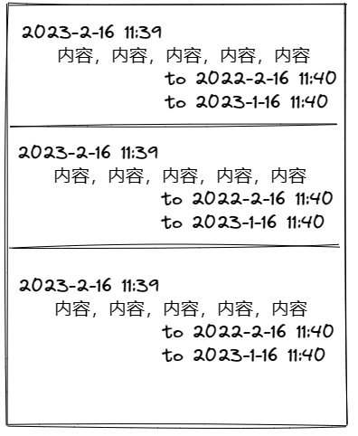

# 我的卡片笔记实践01
《卡片笔记写作法》可以使用一句话进行描述：**记笔记，整理到卡片盒中，经常回顾和修改**
* 如何记笔记？
	* 记笔记需要有一个固定的格式，方便整理。这个格式如下：
		* 时间戳：仅仅表示卡片笔记的唯一性，方便后续建立卡片和卡片之间的连接。
		* 标题：归纳卡片内容的核心思想，方便后续的回顾，通过标题可以快速回忆卡片的内容。
		* 内容：卡片笔记的具体内容，使用自己话进行描述。
* 如何整理卡片盒？
	* 把卡片之间呢，可以通过时间戳的形式建立链接。
* 可以通过纸质形式的笔记本写卡片笔记，画一个图进行说明，如下：

