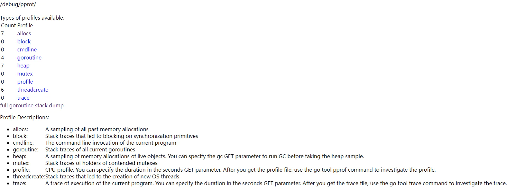

# gin框架中查看pprof

# pprof 是什么
一句话描述：Golang自带的一款开箱即用的性能监控和分析工具

# gin框架使用pprof

## 安装graphviz
[安装graphviz](https://graphviz.org/download/)

查看是否安装成功dot -version

```sh
 ~/t/testgin> dot -version
dot - graphviz version 2.43.0 (0)
libdir = "/usr/lib/x86_64-linux-gnu/graphviz"
Activated plugin library: libgvplugin_dot_layout.so.6
Using layout: dot:dot_layout
Activated plugin library: libgvplugin_core.so.6
Using render: dot:core
Using device: dot:dot:core
The plugin configuration file:
        /usr/lib/x86_64-linux-gnu/graphviz/config6a
                was successfully loaded.
    render      :  cairo dot dot_json fig gd json json0 map mp pic pov ps svg tk visio vml vrml xdot xdot_json
    layout      :  circo dot fdp neato nop nop1 nop2 osage patchwork sfdp twopi
    textlayout  :  textlayout
    device      :  canon cmap cmapx cmapx_np dot dot_json eps fig gd gd2 gif gv imap imap_np ismap jpe jpeg jpg json json0 mp pdf pic plain plain-ext png pov ps ps2 svg svgz tk vdx vml vmlz vrml wbmp webp x11 xdot xdot1.2 xdot1.4 xdot_json xlib
    loadimage   :  (lib) eps gd gd2 gif jpe jpeg jpg png ps svg webp xbm

```

## main文件

下载第三方包

```sh
go get github.com/gin-contrib/pprof
```

在main.go文件中导入包

```go
"github.com/gin-contrib/pprof"
```

注册路由

```go
func main() {
    router := routers.SetupRouter()
    pprof.Register(router)
    if err := r.Run(":8080"); err != nil {
        panic(err)
    }
}
```

启动程序

```sh
go run main.go
```

浏览器访问 `127.0.0.1:gin` 端口号 `/debug/pprof/` 可以看到如下



参数说明：

```sh
allocs :过去所有内存分配的抽样
block :导致在同步基元上阻塞的堆栈跟踪
cmdline :当前程序的命令行调用
goroutine :goroutine堆栈跟踪
heap :活动对象的内存分配的采样
mutex :争用互斥锁的持有者的堆栈跟踪
profile :CPU摘要信息。您可以在seconds GET参数中指定持续时间。获得概要文件之后，使用go工具pprof命令来调查该概要文件。
threadcreate : 操作系统线程堆栈跟踪
trace : 当前程序的执行轨迹。您可以在seconds GET参数中指定持续时间。获得跟踪文件后，使用go工具跟踪命令来调查跟踪。
```

图形化查看

```sh
# 执行命令后,会在浏览器打开一个窗口
go tool pprof -http=:8000 http://localhost:gin端口号/debug/pprof/goroutine

# 命令解释
-http 表示使用交互式web接口查看获取的性能信息,指定可用的端口即可。例如上面的8000
debug/pprof/需要查看的指标 (allocs,block,goroutine,heap...)
```


