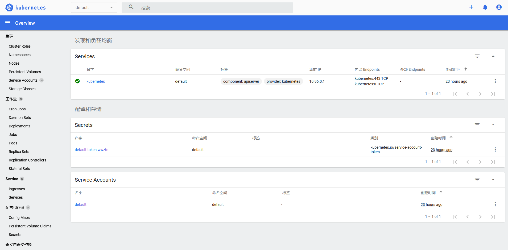

# k8s搭建DashBoard
**参考**
[k8s搭建DashBoard - 腾讯云开发者社区-腾讯云 (tencent.com)](https://cloud.tencent.com/developer/article/2128325) 


k8s部署dashboard，注意k8s的版本对应，可以在这里查看对应的版本：[kubernetes/dashboard (github.com)](https://github.com/kubernetes/dashboard/releases) 
```sh
# 下载文件
curl  https://raw.githubusercontent.com/kubernetes/dashboard/v2.0.3/aio/deploy/recommended.yaml | cat >> recommended.yaml


# 修改kubernetes-dashboard的Service类型
vim recommended.yaml

```


```yaml
# 修改如下新增内容
kind: Service
apiVersion: v1
metadata:
  labels:
    k8s-app: kubernetes-dashboard
  name: kubernetes-dashboard
  namespace: kubernetes-dashboard
spec:
  type: NodePort # 新增
  ports:
    - port: 443
      targetPort: 8443
      nodePort: 30009 # 新增
  selector:
    k8s-app: kubernetes-dashboard
```

```sh
# 部署DashBoard
kubectl create -f recommended.yaml

# 查看namespace为kubernetes-dashboard下的资源：
kubectl get pod,svc -n kubernetes-dashboard

# 创建账户
kubectl create serviceaccount dashboard-admin -n kubernetes-dashboard

# 授权
kubectl create clusterrolebinding dashboard-admin-rb --clusterrole=cluster-admin --serviceaccount=kubernetes-dashboard:dashboard-admin

# 获取账号token
root@master200:~# kubectl get secrets -n kubernetes-dashboard | grep dashboard-admin                                                                                      
dashboard-admin-token-qfps4        kubernetes.io/service-account-token   3      24s

root@master200:~# kubectl describe secrets dashboard-admin-token-qfps4  -n kubernetes-dashboard
Name:         dashboard-admin-token-qfps4
Namespace:    kubernetes-dashboard
Labels:       <none>
Annotations:  kubernetes.io/service-account.name: dashboard-admin
              kubernetes.io/service-account.uid: 71b89da0-bd92-4661-99b2-a0e42f1e24af

Type:  kubernetes.io/service-account-token

Data
====
ca.crt:     1025 bytes
namespace:  20 bytes
token:      eyJhbGciOiJSUzI1NiIsImtpZCI6IkxyeTF5TUpDa2FFUi01clRKZWliZjFLdjU4S1laUVJTNEpoZ25HdUxjcmcifQ.eyJpc3MiOiJrdWJlcm5ldGVzL3NlcnZpY2VhY2NvdW50Iiwia3ViZXJuZXRlcy5pby9zZXJ2aWNlYWNjb3VudC9uYW1lc3BhY2UiOiJrdWJlcm5ldGVzLWRhc2hib2FyZCIsImt1YmVybmV0ZXMuaW8vc2VydmljZWFjY291bnQvc2VjcmV0Lm5hbWUiOiJkYXNoYm9hcmQtYWRtaW4tdG9rZW4tcWZwczQiLCJrdWJlcm5ldGVzLmlvL3NlcnZpY2VhY2NvdW50L3NlcnZpY2UtYWNjb3VudC5uYW1lIjoiZGFzaGJvYXJkLWFkbWluIiwia3ViZXJuZXRlcy5pby9zZXJ2aWNlYWNjb3VudC9zZXJ2aWNlLWFjY291bnQudWlkIjoiNzFiODlkYTAtYmQ5Mi00NjYxLTk5YjItYTBlNDJmMWUyNGFmIiwic3ViIjoic3lzdGVtOnNlcnZpY2VhY2NvdW50Omt1YmVybmV0ZXMtZGFzaGJvYXJkOmRhc2hib2FyZC1hZG1pbiJ9.u_oq85rr_0DPU3fI2HmVEiXVTGKdLU_fmc2nTWMNNFSBCoSwmvL_WhEhQNrr9VLaSEe4wOlB-UOQtn7EN5kskDt6936S8lONQbCgarrlvuC_2NslXh39ZHM-lFt9GlWuK2JIHLTQMJv2ZedEYHpX9oXm9uEv4ehe8xnU1Jr2k9iVihDGKzQSSONRITAbuGynoJraVOXa6PUczt_apBnxqtJn45xFxsvS6PBVVF-MEskgnrjNmUdgJxzqVVojHSdHBw8hNwScNry15J46PBb-zKqoqC7-k70qdWz_6vVDKPxCxJvfpZcAdyjE5hQf_8saeAJ9m5xqwO8s_cLwr5eIig


# 通过浏览器访问DashBoard的UI(注意：使用火狐浏览器，火狐有不安全访问模式)
# 粘贴上方的token

```

进入以后如图所示



