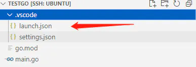
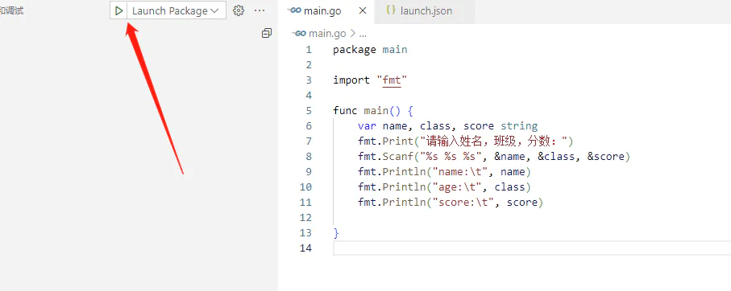

**luanch.json配置文件位置**



添加 `"console": "integratedTerminal"` 使用 `debug`调试时，可以在终端中写入内容。

```json
{
    "version": "0.2.0",
    "configurations": [
        {
            "name": "Launch Package",
            "type": "go",
            "request": "launch",
            "mode": "auto",
            "program": "${fileDirname}",
            "console": "integratedTerminal"
        }
    ]
}
```
**示例**

```go
package main

import "fmt"

func main() {
    var name, class, score string
    fmt.Print("请输入姓名，班级，分数：")
    fmt.Scanf("%s %s %s", &name, &class, &score)
    fmt.Println("name:\t", name)
    fmt.Println("age:\t", class)
    fmt.Println("score:\t", score)
}
```




