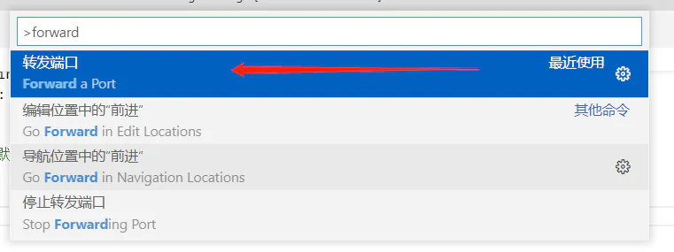

远程开发可以是在服务器上，也可以在虚拟机上。（ps:我本地使用虚拟机安装linux系统，使用vscode连接）

**第一：**  安装插件：Remote - SSH

**第二：** 远程连接

打开ctrl+shift+p命令面板，输入 remote，找到Remote - SSH: Add New SSH Host。

**第三：**  根据提示输入你要连接的远程服务器的用户名、主机地址（如果没有服务器，在本地启动虚拟机也可以），记得带上 -A 参数（开启代理转发功能）：

**第四：**  输入连接信息后，选择将该信息保存到一个配置文件中：

**第五：**  端口转发 VS Code 提供了端口转发功能，可以配置远程服务器和本地端口的映射，以支持本地直接访问到远程服务器的应用。 按 `ctrl + shift + p` 打开命令面板，搜索 `"forward"`，选择转发端口：

可以对转发的端口进行配置，就可以在本地访问应用了。

