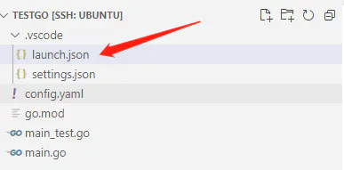
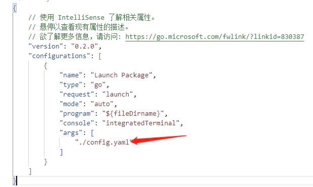
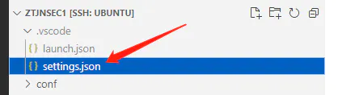
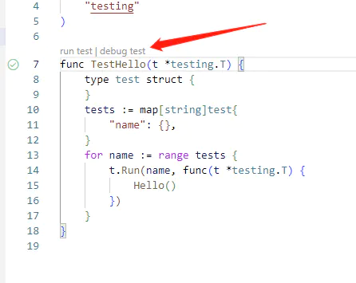

# 配置vscode获取命令行参数
## 项目运行debug获取命令行参数

在 `.vscode/launch.json` 增加 `args` 参数。

**示例**





```go
package main

import (
    "flag"
    "fmt"
    "os"
    "testing"
)

func init() {
    // 单元测试时，获取命令行参数需要执行 testing.Init()
    testing.Init()
    // 设置配置文件路径，默认./conf/config.yaml
    configFilePath := flag.String("config", "./config.yaml", "config file path")
    flag.Parse()
    content, err := os.ReadFile(*configFilePath)
    if err != nil {
        fmt.Println("read file failed, err:", err)
        return
    }
    fmt.Println(string(content))

}

func main() {
    fmt.Println("hello............")
}

func Hello() {
    fmt.Println("func of Hello")
}
```

此时按 F5 执行debug，可以读取到配置文件 `./config.yaml`

## 单元测试获取命令行参数

在下面文件中，添加配置 `go.testFlags`



```json
{
    "go.inferGopath": false,
    "go.testFlags": [
        "-v",
        "-args",
        "-config",
        "./config.yaml"
    ],
}
```

为函数`Hello()`编写单元测试

```go
package main

import (
    "testing"
)

func TestHello(t *testing.T) {
    type test struct {
    }
    tests := map[string]test{
        "name": {},
    }
    for name := range tests {
        t.Run(name, func(t *testing.T) {
            Hello()
        })
    }
}
```

点击运行即可




## PS Gin框架

如果在 `init` 中获取命令行参数需要添加如下 `testing.Init()` 会导致gin框架启动时，提示信息不显示，此时，在 `main.go` 文件的`main` 函数中，增加 `gin.SetMode(gin.DebugMode)` 即可